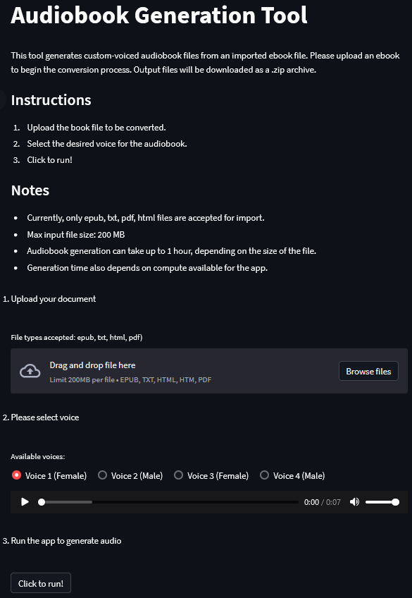

# Audiobook Gen

## About
Audiobook Gen converts text to audiobook format. It allows you to choose which voice you want to listen to.

- Do you want to listen to a book that isn't available on Audible?
- Have you tried an audiobook from LibriVox and found the audio quality lacking?
- Don't have time to sit and read a document, but would prefer to listen to it?

You can input various text formats (`txt`, `pdf`, `epub` - more options in development) and output a `zip` archive of audio files (`wav`). This is an open-source tool based on the [Silero text-to-speech toolkit](https://github.com/snakers4/silero-models) and uses Streamlit to deliver the application.

# Demo

## HuggingFace Space
A demonstration of this tool is hosted at HuggingFace Spaces - see [Audiobook_Gen](https://huggingface.co/spaces/mkutarna/audiobook_gen).

# Future

Here is a list features in development and planned for the future:
- `html` file import
- `mobi`, `azw` audiobook output
- improved audio file output handling
- Docker image for local use